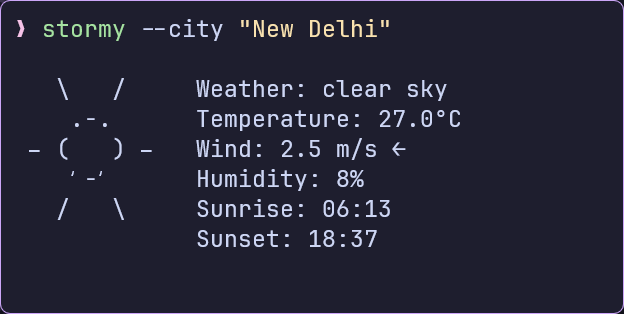
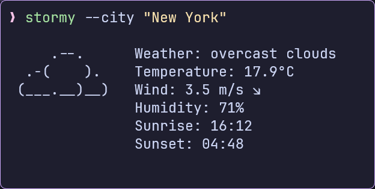
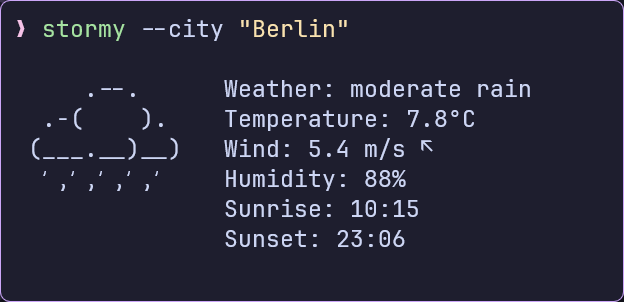
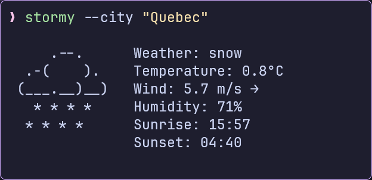

# stormy

Neofetch-like, minimalistic, and customizable weather-fetching CLI based on
[rainy](https://github.com/liveslol/rainy)


## Features

- Current weather conditions with ASCII art representation
- Temperature, wind, humidity, and sunrise/sunset times
- Customizable units (metric, imperial, standard)
- Local configuration file
- Color support for terminals

## Installation

### Prerequisites

- Go 1.19 or higher
- An API key from [OpenWeatherMap](https://openweathermap.org/api)

### Build from Source

```bash
# Clone the repository
git clone https://github.com/ashish0kumar/stormy.git
cd stormy

# Build the application
go build -o stormy ./src

# Move to a directory in your PATH (optional)
sudo mv stormy /usr/local/bin/
```

## Configuration

`stormy` will create a default configuration file on first run:

- Linux/macOS: `~/.config/stormy/stormy.toml`
- Windows: `%APPDATA%\stormy\stormy.toml`

### Configuration Options

- `api_key`: Your OpenWeatherMap API key.
- `city`: The city for which to fetch weather data.
- `units`: Units for temperature and wind speed (`metric`, `imperial` or `standard`).
- `timeplus`: Hours to add to the UTC timezone.
- `timeminus`: Hours to subtract from the UTC timezone.
- `showcityname`: Whether to display the city name (`true` or `false`).
- `showdate`: Whether to display the current date (`true` or `false`).
- `timeformat`: Time format for sunrise and sunset times (`24` or `12`).
- `use_colors`: Enables and disabled text colors (`true` or `false`).


### Example Config

```toml
api_key = "your_api_key"
city = "New Delhi"
units = "metric"
timeplus = 0
timeminus = 0
showcityname = false
showdate = false
timeformat = "24"
use_colors = false
```

## Usage

```bash
# Basic usage
stormy

# Specify city via command line
stormy --city "New York"

# Use imperial units
stormy --units imperial

# Show help
stormy --help
```

## Examples

| Clear                        | Cloud                        |
| ---------------------------- | ---------------------------- |
|  |  |

| Rain                       | Snow                       |
| -------------------------- | -------------------------- |
|  |  |

## Acknowledgements

- [OpenWeatherMap](https://openweathermap.org/) for providing weather data
- [rainy](https://github.com/liveslol/rainy) for the overall idea, structure and
  design of the project

## License

[MIT](LICENSE)
